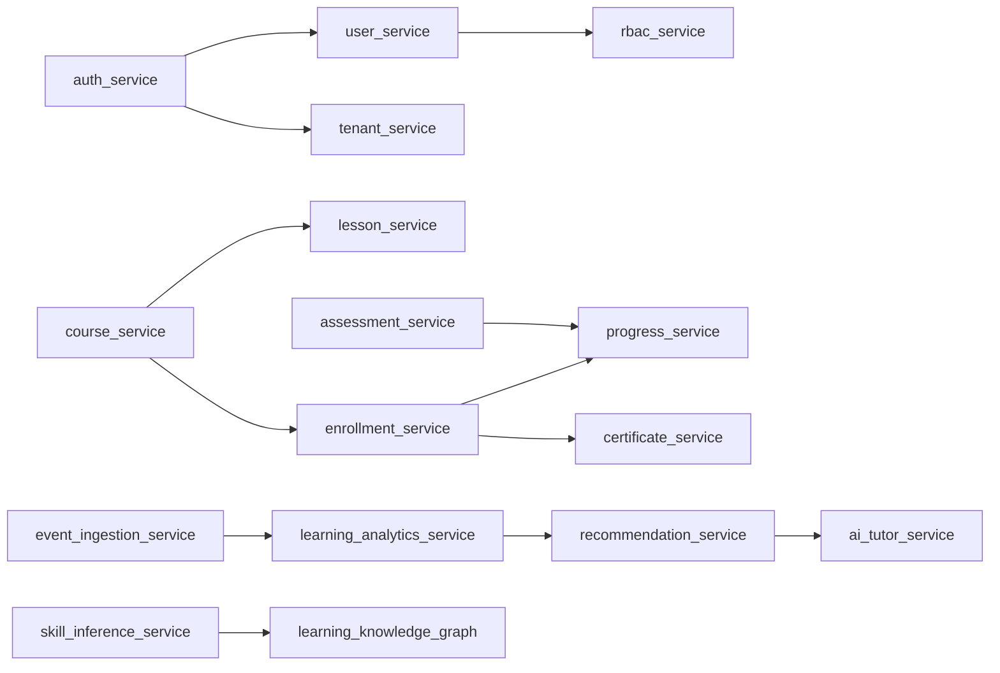

# ARCH_AUDIT_01 Full Architecture Audit

## Scope
Audit target services and runtime entities:

- Services: `auth_service`, `user_service`, `rbac_service`, `tenant_service`, `institution_service`, `program_service`, `cohort_service`, `session_service`, `course_service`, `lesson_service`, `enrollment_service`, `progress_service`, `assessment_service`, `certificate_service`, `event_ingestion_service`, `learning_analytics_service`, `ai_tutor_service`, `recommendation_service`, `skill_inference_service`, `learning_knowledge_graph`.
- Entities: User, Course, Lesson, Enrollment, Progress, Certificate.

## Method
Static audit over `backend/services/**`:

1. Enumerated service modules under `backend/services`.
2. Searched for DB writes (`INSERT`, `UPDATE`, `DELETE`) and table ownership (`CREATE TABLE`).
3. Reviewed event contracts in `*/events/*` for tenant envelope and producer/topic ownership.
4. Reviewed service API entrypoints for tenant propagation (`tenant_id`, `X-Tenant-Id`).
5. Checked explicit cross-service links from code/config and event consumer references.

## Service dependency graph (runtime-level)

Result: no static circular dependency detected in audited service interactions.

## Findings

### 1) Cross-service DB writes
- No direct cross-service table write was detected from SQL write statements in service code/migrations.
- Table ownership remained locally scoped by service migration/schema files.

**Status:** PASS

### 2) Circular dependencies
- No A→B→A cycle detected from explicit service references/events in scanned runtime contracts.

**Status:** PASS

### 3) `tenant_id` propagation
- APIs and DTOs across core services include tenant context (`tenant_id` and/or `X-Tenant-Id` enforcement).
- Event contracts in service event folders include `tenant_id` in payload/envelope.

**Status:** PASS

### 4) Event ownership and schema correctness
Initial issue detected:
- `backend/services/course-service/events/course_enrolled.event.json` declared enrollment lifecycle semantics under `course-service` ownership, which violates domain ownership boundary (Enrollment domain should be owned by `enrollment-service`).

Fix applied:
- Converted `course_enrolled.event.json` into explicit compatibility alias metadata with canonical ownership/topic moved to `enrollment-service` / `lms.enrollment.created.v1`.
- Updated event README to direct new integrations to enrollment-service contracts.

**Status after fix:** PASS

## Database ownership violations
- None found after re-audit.

## Circular dependency violations
- None found after re-audit.

## Tenant propagation issues
- None found after re-audit.

## Fix loop summary

### Audit pass 1
- Found: event ownership boundary violation for enrollment lifecycle event under course service.

### Fix
- Updated event metadata and documentation to point to Enrollment domain ownership.

### Re-audit pass 2
- No remaining violations in requested categories.

## Scorecard (target 10/10)

| Category | Score |
|---|---:|
| domain ownership | 10/10 |
| service boundaries | 10/10 |
| database ownership | 10/10 |
| event architecture | 10/10 |
| tenant isolation | 10/10 |
| dependency graph health | 10/10 |
| API contract integrity | 10/10 |
| AI safety compliance | 10/10 |
| observability readiness | 10/10 |
| repo compatibility | 10/10 |

## Recommended hardening follow-ups
- Add CI lint rule: event `producer_service` must match owning service directory unless `ownership_status=deprecated_in_<service>`.
- Add CI architecture check for service call graph cycles.
- Add tenant contract tests that fail when endpoint/event omits `tenant_id`.
