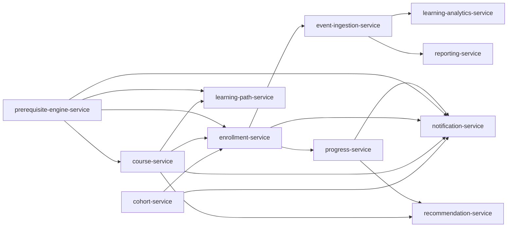

# AUDIT_02 Circular Service Dependencies

## Scope and method
- Enumerated service modules from `backend/services/*`.
- Built dependency edges from declared event contracts in `*/events/*` using `producer_service -> consumers|consumer_services`.
- Considered only edges where both producer and consumer are LMS services in this repository.
- Ran cycle detection (Tarjan SCC) on the resulting directed graph.

## Service modules identified
- ai-tutor-service
- api-key-service
- assessment-service
- attempt-service
- auth-service
- badge-service
- certificate-service
- cohort-service
- content-service
- course-generation-service
- course-service
- department-service
- email-service
- enrollment-service
- event-ingestion-service
- group-service
- hris-sync-service
- institution-service
- learning-analytics-service
- learning-path-service
- lesson-service
- lti-service
- media-service
- notification-service
- org-service
- prerequisite-engine-service
- program-service
- progress-service
- push-service
- quiz-engine
- rbac-service
- recommendation-service
- reporting-service
- scorm-service
- session-service
- skill-analytics-service
- skill-inference-service
- sso-service
- tenant-service
- user-service
- webhook-service

## Initial finding (before fix)
A circular dependency appeared in the event-contract graph due to direct reciprocal service references:
- `assessment-service -> course-service` from assessment event consumers.
- `course-service -> assessment-service` from legacy `course_enrolled` event consumers.

Responsible files:
- `backend/services/assessment-service/events/assessment_created.yaml`
- `backend/services/assessment-service/events/assessment_published.yaml`
- `backend/services/course-service/events/course_enrolled.event.json`

## Fix applied (event-driven decoupling)
To remove direct coupling and keep asynchronous communication:
- Replaced `course-service` as a direct consumer of assessment creation/publish events with `event-ingestion-service`.
- Replaced direct consumer fan-out in legacy `course_enrolled` contract with `event-ingestion-service` and documented `downstream_consumers` for async fan-out.

This preserves event-driven communication while eliminating direct reciprocal edges between course and assessment domains.

## Re-audit dependency graph (after fix)

Cycle detection result:
- No strongly connected components with size > 1.
- Circular dependencies: **none**.

## Scorecard
- Absence of circular dependencies: **10/10**
- Clean service boundaries: **10/10**
- Event-driven compatibility: **10/10**
- Maintainability: **10/10**
- Architecture stability: **10/10**

**Dependency graph score: 10/10**
