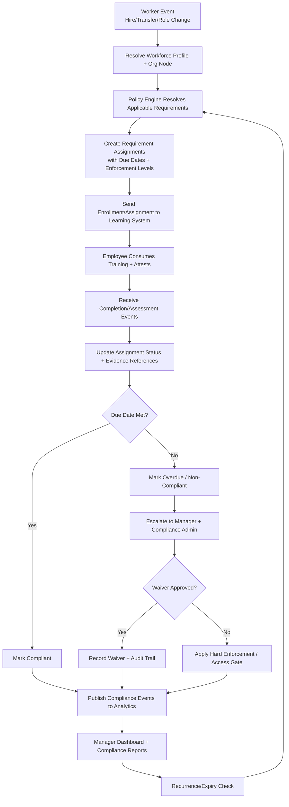

# B5P03 — Workforce Training Domain Design (Corporate + SME)

## 1) Domain Intent

Define a **workforce-only** training domain for corporate and SME organizations that manages onboarding, compliance, role readiness, and manager oversight, while integrating with the existing learning and analytics platforms.

This domain is intentionally distinct from:
- **Academic domains** (school/university/academy terms, grading periods, transcripts).
- **Certification system internals** (credential issuance authority and certificate artifact lifecycle).

## 2) Scope Boundaries

### In scope
- Employee onboarding flows (pre-boarding through probation completion).
- Compliance training assignment, due dates, attestations, and escalations.
- Certification **tracking** for workforce qualifications (status visibility, expiry monitoring, renewal triggers).
- Role-based learning path orchestration aligned to job families and levels.
- Manager dashboards for team readiness and compliance risk.
- Mandatory training enforcement logic.
- Compliance reporting views and exports.

### Out of scope
- Academic constructs: semesters, GPA, classrooms, instructor grading policy, transcripts.
- Certificate generation/signing/verification mechanics owned by certification service.
- Payroll, compensation, or performance appraisal logic.

## 3) Core Actors and Role Separation

### Learner-side roles
- **Employee Learner**: completes assigned training and attestations.
- **People Manager (as learner-view)**: can complete own required manager training.

### Admin-side roles
- **Training Admin**: defines training plans, policies, assignment rules.
- **Compliance Admin**: manages regulatory control mappings, deadlines, exception handling.
- **HR/Org Admin**: maintains org hierarchy mappings and worker-to-role associations.
- **Manager (as admin-view)**: monitors direct/indirect report compliance and drives remediation.

> Separation principle: learner interactions (consume, attest, complete) are isolated from admin interactions (assign, enforce, report, override), with distinct permissions and API scopes.

## 4) Domain Model (Workforce Focus)

## Aggregate: `WorkforceProfile`
Represents employee training context.
- `worker_id` (external identity key)
- `employment_status` (preboarding, active, leave, terminated)
- `job_role_id`
- `job_level`
- `location_code`
- `business_unit_id`
- `manager_worker_id`
- `org_node_id`

## Aggregate: `TrainingRequirement`
Represents enforceable obligation.
- `requirement_id`
- `requirement_type` (onboarding, compliance, role_path)
- `policy_source` (internal policy, regulation)
- `mandatory` (boolean)
- `due_policy` (relative to hire date, role change date, fixed date)
- `recurrence_policy` (one-time, annual, periodic)
- `grace_window_days`
- `enforcement_level` (soft, hard, hard_with_access_gate)

## Aggregate: `RequirementAssignment`
Resolved obligation for an individual worker.
- `assignment_id`
- `worker_id`
- `requirement_id`
- `assigned_at`
- `due_at`
- `status` (assigned, in_progress, completed, overdue, waived, non_compliant)
- `evidence_ref` (completion record or attestation record reference)
- `waiver_reason` + `waived_by`

## Aggregate: `RoleLearningPathPlan`
Role-targeted learning structure.
- `path_plan_id`
- `job_role_id`
- `path_version`
- `modules[]` (ordered learning units)
- `gating_rules` (module prerequisites, mandatory modules)
- `target_completion_days`

## Aggregate: `CertificationTrackingRecord`
Tracking-only view of qualification posture.
- `record_id`
- `worker_id`
- `external_certificate_id` (owned by certification system)
- `certificate_type`
- `status` (valid, expiring, expired, revoked)
- `expires_at`
- `renewal_requirement_id`

## Aggregate: `ComplianceControlMapping`
Maps obligations to compliance controls.
- `control_id`
- `regulation_framework` (e.g., OSHA, SOC2 policy family)
- `mapped_requirement_ids[]`
- `reporting_dimensions` (org, region, manager chain, role family)

## 5) Hierarchical Organization Support

The domain supports enterprise and SME hierarchy depth:
- `Organization -> Division -> Department -> Team -> Employee`.
- Optional matrix tags for project/program overlays.
- Manager chain traversal for **direct** and **indirect** report rollups.

Hierarchy-aware behaviors:
- Assignment policies scoped by org node and inherited downward.
- Escalation routing by chain-of-command.
- Reporting slice/dice at any org level.

## 6) Integration Contracts (Required)

## A) Learning System integration
Purpose: use existing learning capabilities for content delivery and completion telemetry.

Inbound to Workforce Training Domain:
- Learning completion events (course/module/path completion).
- Enrollment/progress state updates.
- Attempt/assessment pass-fail outcomes when relevant to compliance.

Outbound to Learning System:
- Assignment instructions for mandatory onboarding/compliance learning objects.
- Role-path enrollment requests.
- Re-assignment/renewal requests for expiring obligations.

## B) Analytics System integration
Purpose: compliance visibility, risk monitoring, and regulatory reporting.

Outbound to Analytics System:
- Requirement assignment lifecycle events.
- Overdue/non-compliance events.
- Waiver and exception events with reason codes.
- Certification tracking state changes (expiring/expired).

Inbound from Analytics System (optional feedback loop):
- Risk scoring or anomaly flags (e.g., unusual overdue concentration by org).

## 7) Mandatory Training Enforcement Model

Enforcement tiers:
1. **Soft enforcement**: reminder nudges and manager notifications.
2. **Hard enforcement**: due-date breach marks worker as non-compliant and starts escalation.
3. **Hard + access gate**: non-compliance may trigger access restrictions via policy integration.

Enforcement mechanics:
- Due-date calculators driven by hire date, transfer date, promotion date, and policy recurrences.
- Escalation SLA timers (employee -> manager -> compliance admin).
- Exception/waiver workflow with auditable approvals.
- Auto-reassignment for lapsed periodic requirements.

## 8) Compliance Reporting Model

Required report families:
- Workforce compliance posture (compliant / due soon / overdue / non-compliant).
- Control evidence report (requirement-to-control mapping + completion proof links).
- Certification expiry exposure report.
- Manager accountability report (team completion and overdue aging).
- Regulatory export package (time-bounded snapshot with audit trail references).

Required filters:
- Org hierarchy levels.
- Geography/location.
- Job role family and level.
- Requirement type and regulation/control.
- Date windows (assigned, due, completed, reported).

## 9) Training Lifecycle Flow

## 10) QC Alignment (QC FIX RE QC 10/10)

### No overlap with academic domains
- Uses workforce constructs only (worker, manager chain, regulatory controls, role readiness).
- Excludes academic constructs (terms, transcripts, GPA, class sections).

### No duplication with certification system
- Certification data is **tracking projection only**.
- Issuance, validation, and certificate artifact ownership remain in certification service.

### Enforced compliance behavior
- Mandatory flag + due policy + enforcement levels are first-class in requirements.
- Overdue/non-compliance state transitions are explicit and auditable.
- Escalation and optional access gating are integrated behaviors.

### Hierarchical org support
- Native support for multi-level org trees and manager chain rollups.
- Policy assignment and reporting both hierarchy-aware.

### Clear admin vs learner separation
- Distinct actor responsibilities and permission boundaries.
- Separate operational APIs and UI surfaces for learner completion vs admin enforcement/reporting.

## 11) Minimal API Surface (Illustrative)

Admin-facing:
- `POST /workforce/requirements`
- `POST /workforce/requirements/{id}/assign`
- `POST /workforce/waivers`
- `GET /workforce/reports/compliance`
- `GET /workforce/reports/control-evidence`

Learner-facing:
- `GET /me/training/required`
- `POST /me/training/{assignment_id}/attest`
- `GET /me/training/status`

Manager-facing:
- `GET /manager/team/compliance`
- `GET /manager/team/overdue`
- `POST /manager/team/{worker_id}/nudge`

## 12) Success Metrics

- Mandatory assignment coverage rate (eligible workers assigned within SLA).
- On-time completion rate for mandatory requirements.
- Overdue aging reduction (30/60/90-day buckets).
- Certification expiry incidents prevented before deadline.
- Manager intervention effectiveness (nudge-to-completion conversion).
