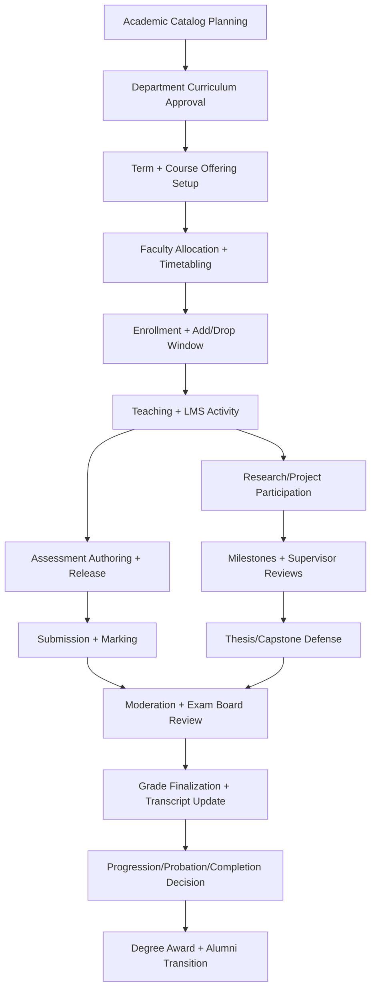

# B5P04 — University Domain Design

> **CAPABILITY DOMAIN EXTENSION (2026-04-04):** This document defines a use-case capability domain extension — a group of capabilities designed for the university operations use-case profile. It is NOT a segment-forked product or a separate platform branch. All capabilities described here are accessed via the entitlement system using `segment_type` and `plan_type` as selection inputs. The core platform remains unchanged. Reference: Master Spec §5.19, `docs/architecture/domain_capability_extension_model.md`.
>
> **DF-05 RESOLVED (2026-04-11):** Body text audit complete — no segment-product framing found. Document uses domain-appropriate terms ("University Domain", "higher-education", "faculty", "department") throughout. `segment_type` appears only as a technical entitlement input in this preamble.

## 1) Domain Intent and Boundary
The **University Domain** models higher-education operations for degree-granting institutions with complex governance, faculty-led delivery, and research obligations.

### In scope
- Department hierarchy across colleges/schools, departments, and programs.
- Faculty workflows (teaching, advising, committee, office hours, grading governance).
- Advanced assessments (rubrics, moderation, thesis/dissertation milestones, exam boards).
- Research/project tracking tied to grants, labs, ethics, publications, and student researcher participation.
- LMS integrations (SCORM + LTI) with institutional controls.
- Integration with learning system and analytics platforms.

### Explicitly out of scope (to prevent overlap)
- **School domain concerns**: guardian interactions, homeroom/section attendance, K-12 gradebook semantics, district policy artifacts.
- **Corporate domain concerns**: manager-driven compliance campaigns, job-role certification matrices, quarterly business KPI training mandates.

This boundary ensures the model supports university complexity without duplicating school or corporate behavior.

---

## 2) Core University Structure (Large-Scale + Multi-Department)

### Organizational hierarchy
1. **Institution** (single legal university tenant)
2. **Academic Unit** (College/School/Faculty, e.g., College of Engineering)
3. **Department** (e.g., Computer Science)
4. **Program** (BS/MS/PhD tracks, interdepartmental programs)
5. **Curriculum Version** (catalog-year controlled requirements)
6. **Course Offering** (term-based instances)
7. **Section/Lab/Tutorial** (delivery units)

### Department separation model
- Departments are first-class entities with:
  - independent curriculum ownership,
  - independent staffing plans,
  - independent assessment boards,
  - independent research portfolios.
- Cross-listed courses are handled through **shared offering links**, not shared ownership.
- Interdisciplinary programs reference multiple departments while preserving single-source ownership for each academic artifact.

### Scale design features
- Tenant-aware partitioning by institution + academic unit + department.
- Event-driven synchronization for timetable, enrollment, assessment, and research updates.
- Bulk operations for registration windows, section publishing, and grade finalization.
- Role + policy matrices to support thousands of faculty and hundreds of departments.

---

## 3) Role Model and Workflow Separation

### Academic roles
- **University Admin**: institution policies, term setup, accreditation controls.
- **Dean/Academic Unit Admin**: college-level planning, quality and staffing oversight.
- **Department Chair**: departmental staffing, curriculum execution, moderation assignment.
- **Program Director**: program requirement governance and progression checks.
- **Faculty Instructor**: content delivery, assessment authoring, grading.
- **Research Supervisor/PI**: research project milestones and student researcher oversight.
- **Teaching Assistant**: delegated delivery and grading tasks under policy constraints.
- **Exam Board Member**: grade moderation, appeals decisions, progression approval.
- **Student (UG/PG/Doctoral)**: enrollment, submissions, milestones, research logs.

### Clear workflow separation
- **Teaching workflow**: syllabus release → delivery → assessment → grading → moderation.
- **Advising workflow**: study plan review → intervention notes → progression recommendation.
- **Research workflow**: proposal → ethics/compliance gate → milestone tracking → publication outputs.
- **Governance workflow**: board review → decision publication → audit lock.

Each workflow has separate ownership and audit trails to avoid role ambiguity across departments.

---

## 4) Advanced Assessment Design

### Assessment archetypes
- Continuous assessment (assignments, labs, quizzes).
- High-stakes exam (midterm/final/proctored digital exam).
- Capstone/project defense.
- Thesis/dissertation milestones (proposal, candidacy, defense, revisions).
- Oral/viva and panel evaluations.

### Assessment capabilities
- Weighted components with prerequisite completion rules.
- Rubric-based and criterion-level scoring.
- Double-marking / blind marking / external moderation.
- Grade scaling and moderation policy pipelines.
- Appeals and reassessment states.
- Outcome mapping to program outcomes + accreditation criteria.

### Data and controls
- Immutable submission versions for academic integrity.
- Marker assignment policies by department.
- Anonymous grading mode for specific assessment types.
- Board-signoff lock before transcript publication.

---

## 5) Research and Project Tracking

### Research entities
- Research Project (funded/unfunded)
- Grant/Contract
- Lab/Research Group
- Supervisor/PI assignment
- Student Researcher participation
- Milestones, deliverables, ethics approvals, publications

### Research workflows
1. Project registration and departmental approval.
2. Grant/ethics linkage and compliance checks.
3. Milestone planning with cadence checkpoints.
4. Student contribution logging (hours, outputs, artifacts).
5. Publication and IP outcome tracking.

### Cross-functional linkage
- Research milestones can generate learning evidence and advanced credits where policy permits.
- Capstone/thesis modules can bind to active research projects for evidence traceability.

---

## 6) Integration Readiness (LMS + Analytics + Standards)

### Learning system integration
- Sync academic hierarchy (institution → unit → department → program).
- Sync course catalog, offerings, sections, enrollment, and staff assignment.
- Consume gradebook and attempt events.
- Publish moderation and final-grade events back to LMS record systems.

### Analytics integration
- Stream events for attendance proxies, engagement, assessment progression, risk signals, and completion.
- Department and program drill-down views with role-scoped access.
- Research analytics (milestone velocity, supervisory load, publication throughput).

### SCORM and LTI readiness
- **SCORM**: launch, attempt, completion, and score event ingestion mapped to university section context.
- **LTI (1.3/Advantage)**: secure tool launch, roster provisioning, deep-linking, assignment/grade return.
- Tool governance by department and program with allowlists and policy constraints.

### Integration contracts (minimum)
- `AcademicStructureChanged`
- `CourseOfferingPublished`
- `EnrollmentChanged`
- `AssessmentLifecycleChanged`
- `GradeFinalized`
- `ResearchMilestoneUpdated`
- `LtiToolLaunchRecorded`
- `ScormAttemptRecorded`

---

## 7) Academic Lifecycle Flow

### Lifecycle controls
- Term-bound state transitions with policy enforcement.
- Department-owned checkpoints before progression decisions.
- Board-governed quality gates for final awards.
- Full audit trace for accreditation and academic appeals.

---

## 8) QC Conformance Checklist (10/10 Target)

- **No duplication with school domain**: excludes guardians/homeroom/K-12 policy artifacts.
- **No overlap with corporate domain**: excludes manager compliance campaign semantics.
- **Academic complexity supported**: moderation, board governance, thesis lifecycle, research tracking.
- **Integration readiness included**: explicit LMS + analytics + SCORM + LTI contracts.
- **Department and role separation clear**: first-class departmental ownership with explicit role workflows.

