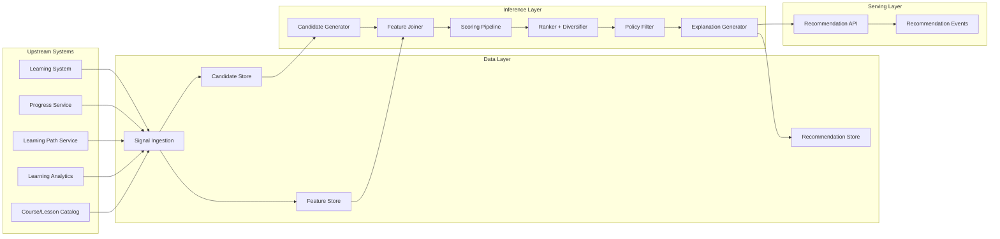

# B6P03 — Recommendation Engine (System Design)

## 1) Objective
Design a **data-driven recommendation engine** that outputs:
- course recommendations,
- next-lesson suggestions,
- personalized learning-path recommendations,

while integrating with existing LMS runtime services and analytics pipelines.

This design enforces:
- no duplication of learning-path sequencing/ownership logic,
- no hardcoded recommendation rules,
- strict separation between **data layer** and **inference layer**,
- extensibility for new recommendation types and ranking strategies.

---

## 2) Scope and Boundaries

### In scope
- Generate ranked recommendation candidates for:
  - `course`
  - `next_lesson`
  - `learning_path_action` (path join/switch/pace adjustment suggestions)
- Use learner:
  - progress data,
  - engagement data.
- Publish recommendation outputs with rationale and feature evidence.

### Out of scope (hard boundary)
- The engine does **not** own or execute learning path graph logic (prerequisite graph traversal, canonical path composition, path milestone state changes).
- The engine does **not** mutate source-of-truth records in learning, progress, or learning-path services.

### Ownership split to prevent duplication
- `learning-path-service`: authoritative path definitions, prerequisites, progression constraints, assignment state.
- `recommendation-service`: ranking and decisioning over candidate actions produced from upstream systems.

---

## 3) System Architecture



### Component responsibilities
1. **Signal Ingestion**
   - Consumes progress snapshots/events and engagement metrics/events.
   - Standardizes all signals into versioned schemas.

2. **Feature Store (Data Layer)**
   - Stores offline + nearline features by `(tenant_id, learner_id, feature_time)`.
   - No decision logic.

3. **Candidate Generator (Inference Layer)**
   - Pulls candidate entities from learning system and learning-path service contracts.
   - Candidate generation is metadata-driven (strategy/config tables), not hardcoded branch conditions.

4. **Scoring Pipeline**
   - Applies configurable models/strategies over features.
   - Emits score components and confidence.

5. **Ranker + Diversifier**
   - Produces final top-N list with tenant/user constraints.

6. **Policy Filter**
   - Applies entitlement, compliance, availability, and prerequisite eligibility constraints.

7. **Explanation Generator**
   - Creates explainability payload using feature contributions and evidence references.

---

## 4) Data Contracts (Data vs Inference Separation)

## 4.1 Input Data Contracts (Data Layer)

### Progress signals (required)
- course completion ratio
- lesson completion ratio
- concept mastery trend
- time-to-complete delta
- blocked prerequisite count

### Engagement signals (required)
- weekly active learning days
- average session duration
- recency (days since last meaningful action)
- recommendation interaction outcomes (shown/clicked/accepted/dismissed)
- activity drop-off trend

### Integration data
- From learning system: content metadata, availability windows, modality.
- From learning-path service: learner path state + available path actions (join/switch/pace actions).
- From analytics: aggregated learner behavior and cohort-relative baselines.

## 4.2 Inference Contracts

### Candidate envelope
```json
{
  "candidate_id": "uuid",
  "candidate_type": "course|lesson|learning_path_action",
  "entity_ref": {"type": "course|lesson|path_action", "id": "string"},
  "context_ref": {"tenant_id": "string", "learner_id": "string"},
  "source": "learning-system|learning-path-service",
  "generated_at": "timestamp"
}
```

### Scored recommendation envelope
```json
{
  "recommendation_id": "uuid",
  "candidate_id": "uuid",
  "score": 0.0,
  "score_components": {
    "progress_fit": 0.0,
    "engagement_fit": 0.0,
    "novelty": 0.0,
    "completion_likelihood": 0.0
  },
  "model_version": "string",
  "feature_snapshot_id": "string",
  "rationale": ["string"],
  "evidence_refs": ["feature:weekly_active_days", "progress:course_completion_ratio"],
  "rank": 1
}
```

---

## 5) Recommendation Flow

## 5.1 Online request flow
1. Client requests recommendations for learner + scope.
2. API resolves feature snapshot ID for latest valid feature set.
3. Candidate generator fetches candidates by scope:
   - course/lesson candidates from learning system,
   - path-action candidates from learning-path service.
4. Feature joiner attaches required progress + engagement features.
5. Scoring pipeline computes per-candidate score components.
6. Ranker sorts and diversifies top-N.
7. Policy filter removes ineligible recommendations.
8. Explanation generator attaches rationale + evidence references.
9. Response returned and recommendation_set persisted.
10. Emission of `recommendation.generated` event for analytics feedback loop.

## 5.2 Feedback/learning flow
1. User interaction events (view/click/accept/dismiss/complete) stream to analytics.
2. Analytics updates engagement aggregates and outcome labels.
3. Feature store refreshes derived features on schedule.
4. Model/strategy retraining recalibrates weights using observed outcomes.
5. New model version is deployed through strategy registry.

This keeps the system data-driven and continuously improving without hardcoded ranking constants.

---

## 6) Strategy and Extensibility Model

## 6.1 Pluggable strategy interfaces
- `CandidateSourceStrategy`
- `FeatureExtractionStrategy`
- `ScoringStrategy`
- `DiversificationStrategy`
- `ExplanationStrategy`

Strategies are selected through a tenant-aware `strategy_registry` table, enabling runtime evolution without code branching per use case.

## 6.2 Config-driven behavior (no hardcoded rules)
- Feature definitions from `feature_catalog`.
- Scoring weights/model IDs from `ranking_config`.
- Eligibility/policy constraints from `policy_config`.
- Scope-specific candidate settings from `candidate_config`.

All recommendation decisions should be reproducible by persisting:
- `feature_snapshot_id`,
- `model_version`,
- `strategy_bundle_version`,
- `config_version`.

---

## 7) Learning Path Non-Duplication Controls

To satisfy QC non-duplication:
1. Recommendation engine consumes **path-action candidates** via API from learning-path service.
2. Recommendation engine never computes path topology, prerequisite chains, or canonical sequence state.
3. Path recommendation outputs are advisory actions only (`join_path`, `switch_path`, `slow_pace`, `accelerate_pace`, `add_remediation_branch`).
4. Any accepted action is executed by learning-path service through its own authoritative workflow.

---

## 8) Quality Controls (QC FIX RE QC 10/10)

- **No duplication with learning path logic**
  - Clear boundary with authoritative path logic in learning-path service only.
- **Must be data-driven**
  - Uses feature store + analytics loop + model/strategy versioning.
- **No hardcoded rules**
  - Uses config/registry-driven candidate and scoring strategies.
- **Must be extensible**
  - Pluggable strategy interfaces + candidate type expansion.
- **Clear separation of data vs inference**
  - Independent contracts and storage layers for input features vs scoring/ranking outputs.

---

## 9) Minimal API Surface (Serving Layer)

- `POST /api/v1/recommendations/generate`
  - Input: learner context + scope + max_results.
  - Output: ranked recommendation set with evidence.
- `GET /api/v1/recommendations/users/{learner_id}/latest`
  - Output: latest active set.
- `POST /api/v1/recommendations/{recommendation_id}/feedback`
  - Input: feedback type.
  - Output: accepted and emitted for analytics loop.

---

## 10) Success Metrics

- recommendation CTR
- acceptance/completion lift vs baseline
- median time-to-next-learning-action
- recommendation diversity index
- model freshness SLA and feature freshness SLA
- explanation coverage rate (must be 100%)
