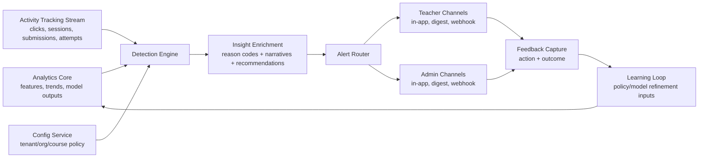
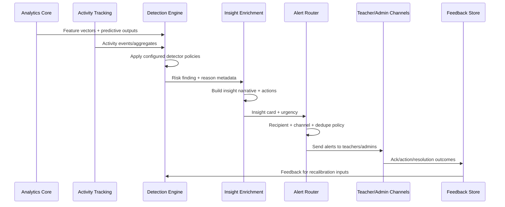

# B6P04 — Learner Risk & Insights System Design

## 1) Objective
Design an **insight-focused learner risk system** that detects and explains risk conditions early, then routes actionable alerts to the right stakeholders.

The system covers:
- dropout prediction
- low engagement detection
- performance alerts

It is intentionally designed to **consume analytics data and activity tracking signals** while avoiding duplication of analytics core responsibilities.

---

## 2) Scope and Boundary

### In scope
- Risk signal generation from modeled and behavioral inputs.
- Configurable detection policies for risk categories.
- Insight assembly (why-risk, confidence, recommended interventions).
- Alert orchestration to teachers and admins.
- Feedback loop capture (acknowledged, acted, dismissed, resolved).

### Out of scope
- Raw event collection/storage pipelines owned by Analytics Core.
- BI dashboarding and metric warehousing owned by Analytics Core.
- Hardcoded policy logic in source code.

### Non-duplication rule (QC)
This service **does not replace Analytics Core**. It consumes:
1. curated analytics features/scores,
2. tracked learner activities,
and transforms them into intervention-grade insights and alerts.

---

## 3) High-Level Architecture

### Components
1. **Detection Engine**
   - Evaluates risk detectors against normalized inputs.
   - Produces risk findings with probabilities, confidence bands, and explainability metadata.

2. **Insight Enrichment Layer**
   - Converts findings into stakeholder-specific insights (teacher/admin lenses).
   - Adds intervention playbooks and urgency semantics.

3. **Alert Router**
   - Applies recipient, channel, timing, and deduplication policies.
   - Ensures separation of detection vs notification.

4. **Configuration Service Integration**
   - Provides tenant-, program-, course-, and cohort-level configuration.
   - Supports versioned policies and rollout controls.

5. **Feedback Capture**
   - Records action outcomes to measure alert usefulness and calibration.

---

## 4) Detection Model Design

## 4.1 Signal Inputs (required)

### A) Analytics data inputs
- dropout propensity score/time-to-dropout estimates
- engagement trend features (weekly momentum, variance, cohort-relative drift)
- performance trajectory features (assessment slope, mastery progression)
- historical intervention effectiveness priors

### B) Activity tracking inputs
- session frequency and recency
- content progression pace
- assignment/quiz submission patterns
- attempt quality signals (retries, abandonment)
- attendance/proctoring proxy events (if enabled)

## 4.2 Detector families
1. **Dropout Prediction Detector**
   - Uses predictive outputs + recent activity deltas.
   - Produces risk state: `monitor`, `elevated`, `critical` (policy-mapped, not hardcoded).

2. **Low Engagement Detector**
   - Detects sustained decline and participation anomalies relative to contextual baselines.
   - Supports seasonality-aware and cohort-aware comparisons.

3. **Performance Alert Detector**
   - Identifies declining achievement trajectory, repeated assessment struggles, or mastery stall.
   - Distinguishes transient dips from persistent downward trends.

## 4.3 No hardcoded threshold principle
- Detector logic references configuration keys (e.g., percentile bands, minimum signal duration, confidence floor).
- All trigger criteria are policy-driven per tenant/program/course.
- Default templates exist but are editable and versioned.

---

## 5) Insight Model (Not Raw Data)

Each finding is converted into an **Insight Card**:
- `insight_id`
- `learner_id`
- `risk_type` (`dropout`, `engagement`, `performance`)
- `risk_level`
- `confidence`
- `contributing_factors[]` (human-readable reason codes)
- `trend_summary` (e.g., "4-week engagement decline with missed submissions")
- `recommended_actions[]` (context-specific interventions)
- `expected_impact_window`
- `expires_at`
- `policy_version`

### Insight quality requirements
- Narrative must explain *why now* and *what to do next*.
- No raw metric dumps in alert payloads by default.
- Drill-through links may expose underlying data for auditability.

---

## 6) Detection vs Notification Separation (QC)

## Detection layer responsibilities
- Evaluate configured policies.
- Generate risk findings and confidence.
- Attach explainability metadata.
- Avoid channel/recipient decisions.

## Notification layer responsibilities
- Determine recipients (teacher/admin role mapping).
- Apply urgency-to-channel policy.
- Deduplicate, throttle, and escalate.
- Manage acknowledgement/reminder cadence.

This separation allows independent tuning of model sensitivity and communication behavior.

---

## 7) Alert Flow

### Flow stages
1. **Ingest & normalize** analytics and activity inputs.
2. **Detect** risk state changes or persistence conditions.
3. **Enrich** into insights with suggested intervention.
4. **Route** to teachers/admins based on policy.
5. **Track outcomes** for effectiveness and continuous improvement.

---

## 8) Configuration Model

Configuration dimensions:
- tenant
- institution/school
- program/department
- course/cohort
- risk type

Configurable controls:
- sensitivity profiles (conservative/balanced/proactive)
- minimum evidence window
- confidence requirements
- suppression windows and dedupe intervals
- escalation timers and reminder cadence
- channel preferences (in-app/email/webhook)
- role-based recipient mapping

Governance:
- versioned policy objects with audit logs
- staged rollout (pilot cohort -> broader rollout)
- simulation mode (evaluate alerts without sending)

---

## 9) Notification Matrix (Teachers & Admins)

| Risk Level | Teacher Notification | Admin Notification | Escalation Behavior |
|---|---|---|---|
| Monitor | Included in digest insight queue | Optional summary only | No immediate escalation |
| Elevated | In-app alert + scheduled digest | Included in admin oversight digest | Reminder if unacknowledged |
| Critical | Immediate in-app/email per policy | Immediate admin alert per policy | Escalate to higher admin role if unresolved |

> Exact channels and timing are policy-configured, not hardcoded.

---

## 10) Data Contracts (Illustrative)

### `RiskFindingDetected`
- `finding_id`
- `learner_id`
- `risk_type`
- `risk_level`
- `confidence`
- `factor_codes[]`
- `detected_at`
- `policy_version`

### `InsightGenerated`
- `insight_id`
- `finding_id`
- `audience` (`teacher`/`admin`)
- `narrative`
- `recommended_actions[]`
- `urgency`
- `expires_at`

### `AlertDispatched`
- `alert_id`
- `insight_id`
- `recipient_id`
- `recipient_role`
- `channel`
- `dispatched_at`

### `AlertOutcomeRecorded`
- `alert_id`
- `outcome_type` (`acknowledged`, `acted`, `dismissed`, `resolved`)
- `outcome_at`
- `intervention_code`

---

## 11) Operational Considerations

- **Latency targets:** near-real-time for critical risk transitions; batch digest for monitor-level insights.
- **Reliability:** at-least-once dispatch with idempotent dedupe keys.
- **Access control:** role-scoped insight visibility (teacher sees roster scope; admin sees organizational scope).
- **Auditability:** policy version + reason code trace for each alert.
- **Privacy:** redact sensitive fields in notifications; full details only in authorized drill-through views.

---

## 12) QC FIX RE QC 10/10 Compliance Mapping

1. **No duplication with analytics core**
   - Uses analytics outputs as inputs; does not own raw analytics warehousing or BI.

2. **Insight-focused, not raw data**
   - Emits narrative insight cards with reasons and recommended interventions.

3. **No hardcoded thresholds**
   - All trigger and severity logic is policy-driven via configuration.

4. **Must be configurable**
   - Multi-level, versioned configuration with rollout/simulation support.

5. **Clear separation of detection vs notification**
   - Distinct components, responsibilities, and tunable policies.

