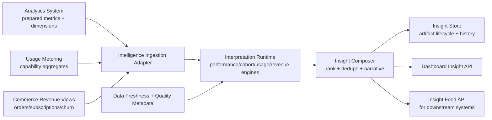

# B6P05 — Analytics Intelligence Layer Design

## 1) Domain Intent

Design an **interpretation-only intelligence layer** on top of the analytics platform to generate actionable insights for all tenant segments without duplicating analytics storage or embedding operational business logic.

The Analytics Intelligence Layer converts prepared analytics signals into:
- dashboard-ready insight cards,
- narrative interpretations,
- trend/risk/opportunity detections,
- segment-specific recommendations (non-executing guidance).

## 2) Scope Boundaries

### In scope
- Performance insights from analytics aggregates and trends.
- Cohort analysis insights (comparative and longitudinal).
- Capability usage insights using usage metering aggregates.
- Revenue insights by linking commerce outcomes with usage and learning outcomes.
- Insight APIs for dashboards and downstream consumers.
- Insight generation orchestration, scoring, and lifecycle management.

### Out of scope
- Raw event ingestion and canonical event schemas (owned by analytics/event layer).
- Fact/dimension storage and metric materialization (owned by analytics data layer).
- Metering event capture and usage aggregation internals (owned by Usage Metering Service).
- Billing, pricing, discounting, entitlement allow/deny, or checkout decisioning (owned by commerce/entitlement/billing services).
- Automatic workflow execution (notifications, assignment actions, gating, policy enforcement).

## 3) QC Separation Rule: Data vs Insights

### Data layer (outside this component)
- Produces validated metrics, aggregates, and semantic definitions.
- Owns metric correctness, refresh SLAs, and dimensional modeling.

### Intelligence layer (this component)
- Reads prepared metrics and metering summaries.
- Interprets patterns using explainable rules/models.
- Emits insight artifacts with confidence and rationale.

> Guardrail: if logic changes a source-of-truth metric or creates domain transaction decisions, it does **not** belong in this layer.

## 4) Required Integrations

## A) Analytics System Integration

**Inbound contracts:**
- KPI aggregates (course/program/team/org/tenant levels).
- Trend windows and period baselines.
- Segment dimensions (tenant, institution, org node, role family, cohort, geography, product tier).
- Data quality/freshness metadata.

**Usage pattern:**
- Read-only query/warehouse access or metric-serving APIs.
- Contracted semantic metric catalog (`metric_key`, owner, formula provenance, latency class).

## B) Usage Metering Integration

**Inbound contracts:**
- Tenant-capability usage aggregates (hourly/daily/monthly).
- Capability dimension metadata references (`capability_key`, `domain_key`, `metric_key`, `unit`).
- Data completeness and late-arrival indicators.

**Usage pattern:**
- Read-only access to aggregate views or metering query APIs.
- Join path to analytics segments through `tenant_id`, optional org/cohort pivots.

## C) Commerce/Revenue Link Integration

**Inbound contracts (read-only):**
- Commerce outcomes (orders, subscriptions, renewals, churn events, refunds).
- Product/package mapping to capability bundles.
- Revenue windows aligned to analytics periods.

**Guardrail:**
- Intelligence layer may compute **revenue insights** (signals/explanations), but never charge, rate, or mutate commercial state.

## 5) Capability Model (Interpretation Modules)

The layer is modular and segment-agnostic. Every module consumes prepared metrics and emits `InsightArtifact` objects.

1. **Performance Insight Engine**
   - Detects KPI acceleration/decline, variance to baseline, target drift, and outliers.
   - Produces impact-ranked interpretations and confidence.

2. **Cohort Insight Engine**
   - Compares cohorts across lifecycle stages (activation, engagement, completion, retention).
   - Detects divergence, convergence, and transition bottlenecks.

3. **Capability Usage Insight Engine**
   - Interprets metering utilization, adoption breadth/depth, and feature concentration.
   - Detects underutilization, saturation risk, and cross-capability dependency patterns.

4. **Revenue Insight Engine**
   - Correlates learning and capability usage patterns with revenue outcomes.
   - Surfaces expansion, contraction, renewal risk, and conversion efficiency signals.

5. **Insight Composer**
   - Deduplicates overlapping findings.
   - Creates narrative summaries for dashboards.
   - Prioritizes insights by impact x confidence x freshness.

## 6) Segment Coverage (Must Support All Segments)

The intelligence model supports all segments through common dimensions and segment adapters:
- Enterprise tenants.
- SME tenants.
- Academic institutions.
- Workforce/compliance programs.
- Multi-tenant platform-level operator views.

Segment handling approach:
- Shared interpretation core.
- Segment-specific threshold profiles and templates.
- No forked storage schemas per segment.

## 7) Core Data Contracts (Insight-Side Only)

## `InsightArtifact`
- `insight_id`
- `tenant_id`
- `segment_scope` (tenant/org/cohort/program/capability)
- `insight_type` (`performance` | `cohort` | `capability_usage` | `revenue`)
- `title`
- `summary`
- `drivers[]` (metric references and directionality)
- `confidence_score` (0..1)
- `impact_score` (normalized)
- `freshness_timestamp`
- `supporting_metrics[]` (references only, not copied facts)
- `recommended_actions[]` (advisory text only)
- `generated_at`
- `expires_at`

## `InsightEvidenceRef`
- `metric_key`
- `dimension_slice`
- `window_start` / `window_end`
- `source_system` (`analytics` | `metering` | `commerce`)
- `source_record_pointer` (URI/query id/version)

## 8) High-Level Architecture



## 9) Insight Generation Flow

```mermaid
flowchart TD
  A[1. Pull prepared metric slices\nfrom analytics + metering + commerce views] --> B[2. Validate freshness/completeness\nagainst policy]
  B --> C{Data quality OK?}
  C -- No --> C1[Emit deferred/low-confidence marker\nno hard failure to dashboards]
  C -- Yes --> D[3. Build interpretation context\nsegment + baseline + comparison windows]
  D --> E[4. Run insight engines\nperformance/cohort/usage/revenue]
  E --> F[5. Score confidence + impact\nattach evidence refs]
  F --> G[6. Compose and deduplicate insights\napply prioritization]
  G --> H[7. Persist InsightArtifact versions]
  H --> I[8. Publish to dashboard/feed APIs]
  I --> J[9. Observe feedback\n(consumption, dismissals, usefulness)]
  J --> K[10. Tune thresholds/templates\nwithout altering source metrics]
```

## 10) Dashboard + Insight Delivery

Required outputs:
- **Dashboard cards:** top insights by impact and recency.
- **Insight detail views:** evidence traces, affected segments, confidence bands.
- **Change tracking:** new/updated/resolved insight states.
- **Filtering:** tenant, segment, cohort, capability, time window, confidence.

Delivery guarantees:
- Read-only to source systems.
- Eventual consistency with analytics refresh cycles.
- Explicit freshness stamps on every insight.

## 11) No Business Logic Leakage Controls

1. **No transactional side effects**
   - Insight engines cannot mutate learning, enrollment, billing, or entitlement states.
2. **Advisory-only recommendations**
   - Output actions are suggestions; execution remains in owning services/workflows.
3. **Metric provenance required**
   - Every insight must reference source metric keys and windows.
4. **Policy isolation**
   - Pricing, compliance enforcement, and entitlement decisions remain outside this layer.
5. **Contract-first validation**
   - Reject inputs that violate semantic metric contracts rather than patching logic in-layer.

## 12) Reliability and Governance

- **Idempotent generation runs** by `(tenant_scope, insight_type, window, version)`.
- **Versioned insight templates/rules** with audit trails.
- **Bias/explainability checks** for model-assisted interpretations.
- **Tenant isolation** on all read/write paths.
- **Observability:** generation latency, stale insight rate, confidence drift, dedupe ratio.

## 13) QC FIX RE QC 10/10 Compliance Checklist

- **No duplication with analytics data layer:** uses references to prepared metrics only; no raw/fact ownership.
- **Interpretation layer only:** all outputs are insight artifacts and narratives, not data pipelines.
- **Supports all segments:** shared dimension model with segment adapters.
- **Clear data vs insights separation:** explicit bounded contexts and guardrails.
- **No business logic leakage:** advisory-only outputs, zero transactional mutation.

