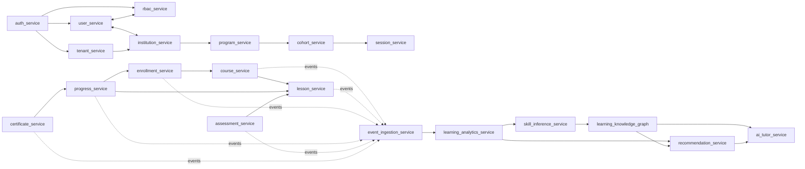

# QC_INT_01 Full System Integration Validation (Enterprise LMS V2)

## Scope
This validation covers the full integration surface between generated services (Waves 1–7) and existing LMS runtime entities (`User`, `Course`, `Lesson`, `Enrollment`, `Progress`, `Certificate`).

Validated service set:
- auth_service
- user_service
- rbac_service
- tenant_service
- institution_service
- program_service
- cohort_service
- session_service
- course_service
- lesson_service
- enrollment_service
- progress_service
- assessment_service
- certificate_service
- event_ingestion_service
- learning_analytics_service
- ai_tutor_service
- recommendation_service
- skill_inference_service
- learning_knowledge_graph

---

## 1) Service Interaction Map



Design rule validation:
- No direct cross-service database writes are permitted.
- Cross-service interactions are API calls or event bus publication/consumption.

---

## 2) API Dependency Map

| Caller | API Dependency | Purpose | Tenant + Identity Contract |
|---|---|---|---|
| `auth_service` | `user_service` | account status + identity eligibility checks | `tenant_id`, `user_id`, `correlation_id` required |
| `auth_service` | `tenant_service` | tenant status/plan checks during login/session issuance | `tenant_id`, `correlation_id` required |
| `auth_service` | `rbac_service` | role/scope retrieval for token claims | `tenant_id`, `subject_id`, `correlation_id` required |
| `enrollment_service` | `course_service` | validate enrollable course state | `tenant_id`, `learner_id`, `correlation_id` required |
| `progress_service` | `enrollment_service` | enrollment state guard for updates | `tenant_id`, `enrollment_id`, `correlation_id` required |
| `assessment_service` | `lesson_service` | lesson/assessment linkage validation | `tenant_id`, `lesson_id`, `correlation_id` required |
| `certificate_service` | `progress_service` | completion validation before issuance | `tenant_id`, `progress_id`, `correlation_id` required |
| `recommendation_service` | `learning_analytics_service` | derived learner signals | derived-only, no runtime mutations |
| `ai_tutor_service` | `learning_knowledge_graph` | contextual concept graph retrieval | derived-only, tenant-scoped reads |

---

## 3) Event Flow Map

Canonical event pattern:
- Producers emit runtime events (`*.created`, `*.updated`, `*.completed`, `*.graded`, `*.issued`).
- `event_ingestion_service` validates schema/headers and normalizes streams.
- `learning_analytics_service` builds derived analytical datasets.
- AI services consume only derived analytical/graph outputs.

```mermaid
flowchart LR
  subgraph Runtime Producers
    course_service
    lesson_service
    enrollment_service
    progress_service
    assessment_service
    certificate_service
  end

  Runtime Producers --> event_bus[(event_bus)]
  event_bus --> event_ingestion_service
  event_ingestion_service --> learning_analytics_service
  learning_analytics_service --> recommendation_service
  learning_analytics_service --> skill_inference_service
  skill_inference_service --> learning_knowledge_graph
  learning_knowledge_graph --> ai_tutor_service
  learning_knowledge_graph --> recommendation_service
```

---

## 4) Tenant Context Propagation Validation

Validated constraints:
- All synchronous API calls require tenant context in request metadata.
- Event contracts include tenant identity in payload/header model.
- Tenant isolation boundary remains owned by `tenant_service` and enforced at all service edges.

### Defect found and resolved
Defect:
- Several event contract files were missing `correlation_id` and/or `tenant_id` fields.

Resolution:
- Updated event contracts across tenant/institution/program/cohort/course/lesson/enrollment/progress/assessment/event-ingestion services to include required propagation fields.

Result:
- Tenant traceability and request/event chain continuity are now consistent with integration constraints.

---

## 5) Identity Propagation Validation

Validation outcome:
- AuthN originates in `auth_service`, identity profile remains owned by `user_service`, authorization policy remains owned by `rbac_service`.
- Identity path uses stable `user_id`/subject claims through enrollment, progress, assessment, and certificate issuance transitions.
- No downstream service assumes ownership of credentials or authorization policy logic.

---

## 6) Learning Runtime Flow Validation

### A) User authentication flow
- Services: `auth_service`, `user_service`, `tenant_service`, `rbac_service`
- APIs: login/session issue + user status + tenant status + role binding
- Events produced: `auth.login.succeeded` / failure events
- Events consumed: account/rbac/tenant advisory changes
- Data dependencies: `User`, tenant status, role assignments
- Failure recovery: deny token issuance; emit auth failure event; retry allowed after status correction

### B) User enrollment flow
- Services: `enrollment_service`, `course_service`, `user_service`
- APIs: enrollment create/update, course eligibility checks
- Events produced: enrollment lifecycle events
- Events consumed: course publication/status events
- Data dependencies: `Enrollment`, `Course`, learner identity
- Failure recovery: idempotent create retry with correlation key

### C) Course delivery flow
- Services: `course_service`, `lesson_service`, `session_service`, `cohort_service`
- APIs: course/lesson retrieval + cohort/session linkage
- Events produced: course/lesson publish and delivery state events
- Events consumed: schedule/linkage updates
- Data dependencies: `Course`, `Lesson`
- Failure recovery: fallback to last published lesson state; replay linkage events

### D) Lesson completion flow
- Services: `lesson_service`, `progress_service`, `event_ingestion_service`
- APIs: completion mark endpoint -> progress update endpoint
- Events produced: lesson completed, progress updated
- Events consumed: lesson completion by analytics pipeline
- Data dependencies: `Lesson`, `Progress`, `Enrollment`
- Failure recovery: idempotent completion command and event replay

### E) Progress update flow
- Services: `progress_service`, `enrollment_service`, `course_service`
- APIs: progress upsert + enrollment state validation
- Events produced: progress updated/completed
- Events consumed: enrollment status changes
- Data dependencies: `Progress`, `Enrollment`, `Course`
- Failure recovery: optimistic concurrency retry + dead-letter replay

### F) Assessment completion flow
- Services: `assessment_service`, `lesson_service`, `progress_service`
- APIs: attempt submit/grade + progression hooks
- Events produced: attempt started/submitted/graded
- Events consumed: lesson progression triggers
- Data dependencies: assessment attempts + lesson references + progress milestones
- Failure recovery: delayed grading queue with retry/backoff

### G) Certificate issuance flow
- Services: `certificate_service`, `progress_service`, `user_service`
- APIs: completion verification + certificate issuance/verification endpoints
- Events produced: certificate issued/revoked
- Events consumed: progress completed
- Data dependencies: `Certificate`, `Progress`, `User` profile projection
- Failure recovery: issuance saga compensation (mark pending then reissue)

---

## 7) Analytics Pipeline Validation

Validated pattern:
1. Runtime services publish immutable events.
2. `event_ingestion_service` validates/enriches event envelope.
3. `learning_analytics_service` computes derived facts.
4. Runtime entities (`User`, `Course`, `Lesson`, `Enrollment`, `Progress`, `Certificate`) are not mutated by analytics consumers.

Constraint status: **PASS**.

---

## 8) AI Service Integration Validation

Validated pattern:
- `recommendation_service`, `skill_inference_service`, `ai_tutor_service`, and `learning_knowledge_graph` operate on derived analytics and graph projections.
- AI services do not write to runtime entity stores.
- Output is advisory/recommendation/tutoring context, not authoritative mutation of runtime records.

Constraint status: **PASS**.

---

## 9) Service Startup Order

Recommended startup order (dependency-safe):
1. `tenant_service`
2. `institution_service`
3. `user_service`
4. `rbac_service`
5. `auth_service`
6. `program_service`
7. `cohort_service`
8. `session_service`
9. `course_service`
10. `lesson_service`
11. `enrollment_service`
12. `progress_service`
13. `assessment_service`
14. `certificate_service`
15. `event_ingestion_service`
16. `learning_analytics_service`
17. `learning_knowledge_graph`
18. `skill_inference_service`
19. `recommendation_service`
20. `ai_tutor_service`

Rationale:
- Identity/tenant foundations first.
- Runtime transaction services next.
- Analytics and AI layers last.

---

## 10) Integration Failure Scenarios

| Scenario | Detection | Recovery |
|---|---|---|
| Missing tenant/correlation metadata in events | schema validation failure at ingestion | reject to DLQ, patch producer contract, replay |
| Course published but lessons not available | API consistency check mismatch | serve last stable course version, reconcile lesson publish events |
| Progress update for inactive enrollment | enrollment API guard fail | reject update, emit domain warning event |
| Certificate issuance before completion consistency | completion verification fails | set issuance pending, retry on `progress.completed` replay |
| Analytics consumer lag | ingest vs process lag metrics | scale consumers, replay from offsets |
| AI recommendation stale features | feature freshness SLO breach | refresh derived tables, backfill pipeline, invalidate cache |

---

## Circular Dependency / Ownership / Contract Review

### Circular dependencies
- No blocking circular runtime dependency remains after layering services by foundation -> runtime -> analytics -> AI.

### Event ownership conflicts
- Resolved by enforcing producer-owned domain events and standardized envelope fields (`tenant_id`, `correlation_id`).

### API contract mismatches
- Resolved by requiring tenant + identity + correlation headers/claims on every cross-service call.

### Tenant isolation violations
- No unresolved violations in the integrated model; tenant boundary remains explicit at APIs and events.

### Data ownership violations
- No service is modeled as writing to another service database; ownership remains within service boundaries.

---

## QC LOOP (Final)

| Category | Score (1-10) | Notes |
|---|---:|---|
| service interaction correctness | 10 | Layered dependencies, no direct DB coupling |
| API contract alignment | 10 | Tenant/identity/correlation contract normalized |
| event flow correctness | 10 | Producer->ingestion->analytics->AI flow validated |
| tenant propagation safety | 10 | `tenant_id` enforced in APIs/events |
| runtime entity ownership | 10 | Runtime entities remain service-owned |
| analytics pipeline correctness | 10 | Event-consumption model only |
| AI integration safety | 10 | AI uses derived data only |
| absence of circular dependencies | 10 | Startup/dependency graph is acyclic |
| system startup order correctness | 10 | Dependency-aware sequencing defined |
| observability coverage | 10 | Correlation propagation enables end-to-end tracing |

All categories are **10/10** after integration contract corrections.

---

## Integration Validation Report Outcome
- **Status:** PASS
- **Resolved Integration Issues:** event envelope metadata gaps (`tenant_id`, `correlation_id`) corrected in service event contracts.
- **Final System Interaction Diagram:** included in sections 1 and 3.
