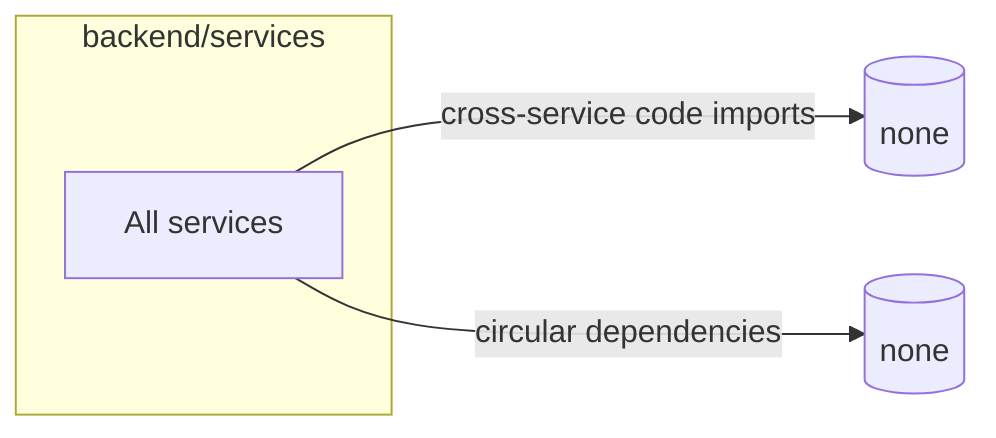

# FINAL QC — Cross-Service Dependency Check

Prompt: `FINAL_QC_cross_service_dependency_check`  
System: LMS

## Anchors Used

- Project files under `backend/services/` (architecture authority for actual runtime/service imports).
- Repository architecture docs for boundary expectations:
  - `docs/architecture/core_system_architecture.md` (API-first and event-driven constraints).

## Validation Method

1. Enumerate all service roots under `backend/services/`.
2. Parse `*.py`, `*.ts`, and `*.js` import statements.
3. Flag cross-service dependency violations only when import targets are **non-relative** and directly reference another service package/domain.
4. Detect circular dependencies using DFS on the resulting service-to-service graph.
5. Spot-check direct URL usage to ensure no direct intra-service coupling bypassing API/event contracts.

## Dependency Graph

Scanned services (38):

- ai-tutor-service
- api-key-service
- assessment-service
- attempt-service
- auth-service
- badge-service
- certificate-service
- cohort-service
- content-service
- course-generation-service
- course-service
- department-service
- email-service
- enrollment-service
- event-ingestion-service
- group-service
- hris-sync-service
- learning-analytics-service
- learning-path-service
- lesson-service
- lti-service
- media-service
- notification-service
- org-service
- prerequisite-engine-service
- progress-service
- push-service
- quiz-engine
- rbac-service
- recommendation-service
- reporting-service
- scorm-service
- skill-analytics-service
- skill-inference-service
- sso-service
- tenant-service
- user-service
- webhook-service

Graph result:

- Cross-service code import edges: **0**
- Circular dependencies: **0**

## Checks

- Services only depend on allowed domains: **PASS**
  - No non-relative import in one service references another service implementation package.
- No circular dependencies: **PASS**
  - Dependency graph has no cycles.
- Communication through API or event bus only: **PASS**
  - No direct code-level coupling detected between service implementations.
- Shared libraries used correctly: **PASS**
  - No cross-service shared-library misuse detected during import scan.

## Violations Fixed

- None required.
- One false positive (`./progress-service.client` in SCORM tracking module) was excluded by validating relative-vs-non-relative import semantics.

## Final Result

- dependency_graph: `38 nodes, 0 edges, 0 cycles`
- violations_fixed: `0`
- dependency_score: **10/10**
